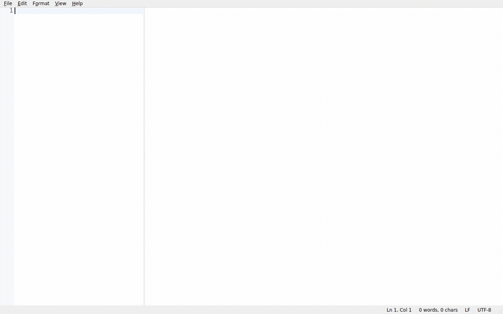
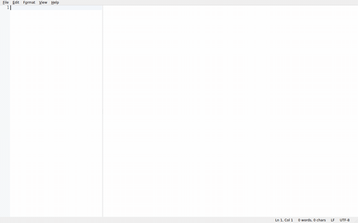
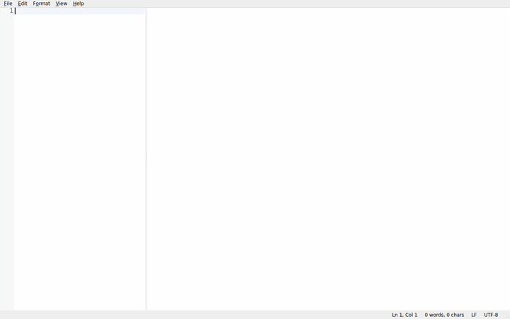
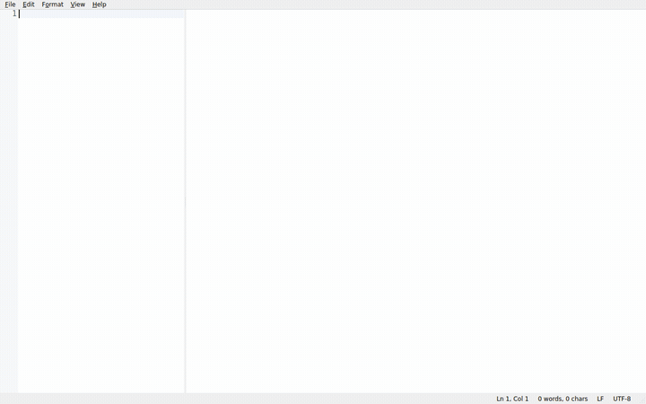

# hungryeditor

[](https://github.com/dagike/hungryeditor/actions/workflows/ci.yml)

A fast, native Markdown editor for people who live in the terminal but want a
real editor for prose — the editing feel of Sublime and Notepad++, the live
preview of Typora, and none of the browser weight.

- **Native.** C++20 + Qt 6. Cold start under a quarter second, small memory
  footprint. Not an Electron app, not an IDE.
- **Real syntax highlighting.** Fenced code blocks are highlighted with the
  actual language grammar — a `rust` block inside your `.md` looks like Rust,
  not grey monospace.
- **Live preview.** Side-by-side rendered view with synced scrolling, mermaid
  diagrams and math.
- **Cross-platform.** Linux and Windows, both first-class.

## Install

Prebuilt packages are on the
[Releases page](https://github.com/dagike/hungryeditor/releases/latest):

| Platform | Artifact | Install |
|---|---|---|
| Debian/Ubuntu | `hungryeditor-*.deb` | `sudo dpkg -i hungryeditor-*.deb` |
| Fedora/openSUSE | `hungryeditor-*.rpm` | `sudo rpm -i hungryeditor-*.rpm` |
| Windows | `hungryeditor-*-win64.msi` | run the installer |
| Windows (portable) | `hungryeditor-*-win64.zip` | extract, run `hungryeditor.exe` |

Either package registers hungryeditor as a handler for `.md` files. See
`CHANGELOG.md` for what's new in each release.

## Features

- **Editing.** Multi-cursor and select-next-occurrence, rectangular column
  selection, find/replace with regex, find in files, a fuzzy command palette,
  go-to-anything file/buffer search, line move/duplicate/delete/join, toggle
  comment, bracket matching and auto-indent.
- **Markdown authoring.** Bold/italic/strikethrough/code/link shortcuts,
  heading cycling, GFM tables with tab navigation and auto-alignment, task
  lists, footnotes, autolinks, YAML front-matter folding, an outline panel
  that tracks the caret, and clickable task checkboxes that write back to the
  source.
- **Live preview.** Synced bidirectional scrolling, themed syntax highlighting
  in fenced code blocks, bundled mermaid diagrams and KaTeX math (fully
  offline), lazy rendering so long documents don't stall, and a strict CSP
  blocking any external resource.
- **Workspace.** A filtered file-tree sidebar, per-workspace state, MRU tab
  switching, caret history navigation, session restore (tabs, cursors,
  geometry, panel layout) and crash-safe autosave drafts.
- **Export & themes.** Standalone HTML export with inlined assets, print and
  PDF export, copy as rich text, four built-in themes (light, dark,
  high-contrast, sepia) plus user JSON themes with custom preview CSS.
- **Diagnostics.** An opt-in local crash reporter (off by default, enabled in
  Preferences) that writes a report with a backtrace — never sent anywhere.

Fenced code blocks get real syntax highlighting from the actual language
grammar (Bash, C, C++, C#, CSS, Go, HTML, Java, JavaScript/JSX, JSON, PHP,
Python, Ruby, Rust, SQL, TOML, TypeScript/TSX, YAML) — not generic monospace.

## Keybindings

| Action | Shortcut |
|---|---|
| New / Open / Save / Save As / Close | standard (`Ctrl+N/O/S/Shift+S/W`) |
| Next / Previous document | `Ctrl+PageDown` / `Ctrl+PageUp` |
| Cycle tabs (MRU) | `Ctrl+Tab` / `Ctrl+Shift+Tab` |
| Find / Replace | standard (`Ctrl+F` / `Ctrl+H`) |
| Find in Files | `Ctrl+Shift+F` |
| Go to Anything | `Ctrl+P` |
| Command Palette | `Ctrl+Shift+P` |
| Go to Line | `Ctrl+G` |
| Navigate Back / Forward | `Alt+Left` / `Alt+Right` |
| Select Next Occurrence | `Ctrl+D` |
| Move Line Up / Down | `Alt+Up` / `Alt+Down` |
| Duplicate / Delete Line | `Ctrl+Shift+D` / `Ctrl+Shift+K` |
| Join Lines | `Ctrl+J` |
| Toggle Comment | `Ctrl+/` |
| Copy as Rich Text | `Ctrl+Shift+C` |
| Bold / Italic | standard (`Ctrl+B` / `Ctrl+I`) |
| Strikethrough | `Ctrl+Shift+X` |
| Inline Code | `Ctrl+E` |
| Link | `Ctrl+K` |
| Heading 1–6 / Paragraph | `Ctrl+Alt+1`…`6` / `Ctrl+Alt+0` |
| Blockquote | `Ctrl+Shift+.` |
| Bulleted / Numbered List | `Ctrl+Shift+8` / `Ctrl+Shift+7` |
| Format Table | `Ctrl+Shift+T` |
| Editor / Split / Preview view | `Ctrl+1` / `Ctrl+2` / `Ctrl+3` |
| Fold Front Matter | `Ctrl+Shift+Y` |
| Toggle Files sidebar | `Ctrl+Shift+E` |
| Toggle Outline panel | `Ctrl+Shift+O` |

## Building

Requirements:

- CMake ≥ 3.24 and Ninja
- A C++20 compiler (GCC 12+, Clang 16+, or MSVC 19.3+)
- Qt 6.4+ — `Widgets`, `Core5Compat`, `WebEngineWidgets`, `WebChannel`,
  `Concurrent`, `PrintSupport`

On Debian/Ubuntu:

```sh
sudo apt install cmake ninja-build build-essential \
  qt6-base-dev qt6-5compat-dev qt6-webengine-dev qt6-webchannel-dev
```

(`qt6-base-dev` already provides `Concurrent` and `PrintSupport`.)

```sh
cmake --preset linux-debug
cmake --build --preset linux-debug
ctest --preset linux-debug
./build/linux-debug/bin/hungryeditor
```

On Windows use the `windows-release` preset from a Developer prompt.

## Demo clips

| Live preview | Command palette |
| --- | --- |
|  |  |

| Multi-cursor editing | Themes |
| --- | --- |
|  |  |

`tests/helpers/record_demo.sh` drives the real app headless (offscreen
rendering, no display needed) through these scripted scenes and encodes
each to an MP4 and a GIF under `demo-recordings/` (git-ignored); the GIFs
above are copied from there into `docs/demo/`:

```sh
cmake --preset linux-release
cmake --build --preset linux-release --target demo_recorder
tests/helpers/record_demo.sh            # every scene
tests/helpers/record_demo.sh themes     # just one
```

## License

MIT — see `LICENSE`. Qt is used under LGPLv3 (dynamic linking); third-party
components retain their own licenses — see `THIRD_PARTY.md`.
